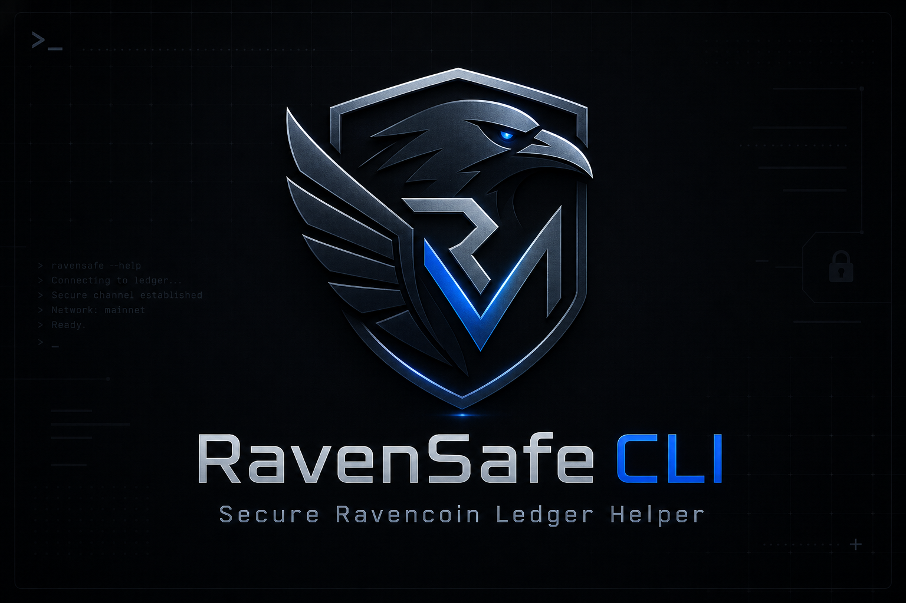

# RavenSafe CLI



RavenSafe CLI is a guided Ravencoin wallet helper for Ledger devices. It helps you scan balances, receive RVN, send RVN, sign on the Ledger, and broadcast through a focused terminal workflow without exposing your recovery phrase.

Normal users should start with guided mode.

## Quick Start

Run the published npm package:

```sh
npx ravensafe-cli
```

Or install it globally:

```sh
npm install -g ravensafe-cli
ravensafe
```

The global package also exposes:

```sh
ravensafe-cli
```

## Why This Exists

RavenSafe CLI was built after practical issues sending RVN from Electrum-RVN with a Ledger device. Electrum-RVN is an important community project, and its repository is now archived and read-only, so some users may need a simpler command-line path for Ledger-backed RVN operations.

This project is not a replacement for every wallet use case. It is a focused Ledger/RVN helper for users who want guided scanning, receiving, sending, signing, and broadcasting from the terminal.

Electrum-RVN repository: https://github.com/Electrum-RVN-SIG/electrum-ravencoin/

## Guided Mode

Start guided mode with:

```sh
ravensafe
```

The interactive menu provides:

```text
1. Scan wallet balances
2. Send RVN
3. Receive RVN
4. Help / safety notes
5. Support / Donate
6. Exit
```

Guided mode is the recommended path for normal use. It walks through balance checks, receive-address discovery, send review, Ledger approval, and broadcast without requiring advanced command flags.

## Local Source Usage

For local development from a cloned repository:

```sh
git clone https://github.com/ELHARAKA/RavenSafe-CLI.git
cd RavenSafe-CLI
npm install
node RavenSafe.js
```

You can also use:

```sh
npm start
```

## Requirements

- Node.js
- A Ledger device with the Ravencoin app installed
- USB access to the Ledger
- Internet access for public Ravencoin explorer lookups and broadcasts

Before using guided mode:

1. Close Ledger Live.
2. Connect and unlock the Ledger.
3. Open the Ravencoin app on the Ledger.

## Safety Promise

- RavenSafe CLI never asks for your Ledger recovery phrase.
- RavenSafe CLI never imports private keys.
- The Ledger remains the signer.
- Sending requires explicit terminal confirmation and approval on the Ledger.
- Always verify the destination address and amount on the Ledger screen.
- Test with a small amount first.
- Use at your own risk.

## What It Does

- Scans Ledger-derived RVN addresses for balances.
- Finds a receiving address and can optionally verify it on the Ledger.
- Guides RVN sends with transaction review before signing.
- Broadcasts a successfully signed guided transaction.
- Shows help, safety notes, and an informational Support / Donate screen.

## Limitations

- RavenSafe CLI is intentionally focused on Ledger-backed RVN wallet operations.
- It expects standard Ledger-derived Ravencoin addresses.
- It depends on the configured public explorer being reachable.
- It is a command-line tool, not a full graphical wallet.
- It does not manage recovery phrases, private keys, staking, assets, or exchange features.

## Support / Donate

RVN donations are optional:

```text
RYW4QozWJtmSipDAzXVJk2nyxRbY1fppbv
```

Explorer: [https://explorer.rvn.zelcore.io/address/RYW4QozWJtmSipDAzXVJk2nyxRbY1fppbv](https://explorer.rvn.zelcore.io/address/RYW4QozWJtmSipDAzXVJk2nyxRbY1fppbv)

## Technical Reference

Advanced command examples, derivation paths, explorer endpoints, transaction flow, troubleshooting, and implementation details are in [Docs.md](Docs.md).
